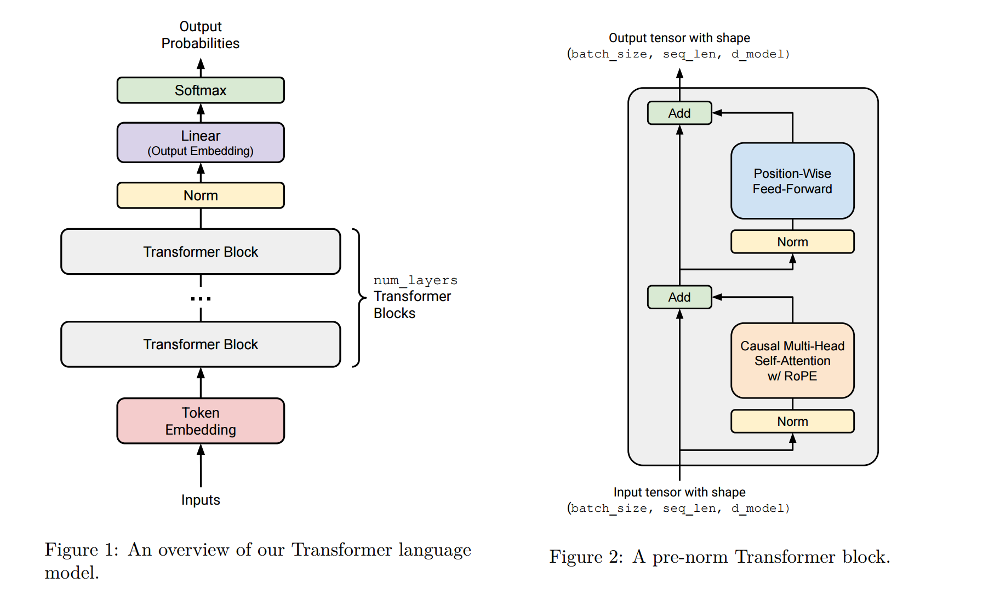

这里记录下transfomer语言模型的一些学习心得，待补充



## 模型参数
带入small参数模型观察可得到参数如下。

transformer block外:
embedding层 [vocab_size, d_model]
RMS_norm [d_model, ]
Linear [vocab_size, d_model]

---

transformer block 12个，每个参数如下：
2个RMS_norm 2 * [d_model, ]
4个attention 4 * [d_model, d_model]
3个swiglu的权重 3 * [d_ff, d_model]

```
Parameter Name                                               Shape                          #Params    Trainable
------------------------------------------------------------------------------------------------------------------------
embedding.W                                                  (10000, 768)                   7680000    True
layers.0.rms_norm1.g                                         (768,)                         768        True
layers.0.multi_head_attn.Q_proj.W                            (768, 768)                     589824     True
layers.0.multi_head_attn.K_proj.W                            (768, 768)                     589824     True
layers.0.multi_head_attn.V_proj.W                            (768, 768)                     589824     True
layers.0.multi_head_attn.O_proj.W                            (768, 768)                     589824     True
layers.0.rms_norm2.g                                         (768,)                         768        True
layers.0.swiglu.w1.W                                         (3072, 768)                    2359296    True
layers.0.swiglu.w2.W                                         (768, 3072)                    2359296    True
layers.0.swiglu.w3.W                                         (3072, 768)                    2359296    True
layers.1.rms_norm1.g                                         (768,)                         768        True
layers.1.multi_head_attn.Q_proj.W                            (768, 768)                     589824     True
layers.1.multi_head_attn.K_proj.W                            (768, 768)                     589824     True
layers.1.multi_head_attn.V_proj.W                            (768, 768)                     589824     True
layers.1.multi_head_attn.O_proj.W                            (768, 768)                     589824     True
layers.1.rms_norm2.g                                         (768,)                         768        True
layers.1.swiglu.w1.W                                         (3072, 768)                    2359296    True
layers.1.swiglu.w2.W                                         (768, 3072)                    2359296    True
layers.1.swiglu.w3.W                                         (3072, 768)                    2359296    True
layers.2.rms_norm1.g                                         (768,)                         768        True
layers.2.multi_head_attn.Q_proj.W                            (768, 768)                     589824     True
layers.2.multi_head_attn.K_proj.W                            (768, 768)                     589824     True
layers.2.multi_head_attn.V_proj.W                            (768, 768)                     589824     True
layers.2.multi_head_attn.O_proj.W                            (768, 768)                     589824     True
layers.2.rms_norm2.g                                         (768,)                         768        True
layers.2.swiglu.w1.W                                         (3072, 768)                    2359296    True
layers.2.swiglu.w2.W                                         (768, 3072)                    2359296    True
layers.2.swiglu.w3.W                                         (3072, 768)                    2359296    True
layers.3.rms_norm1.g                                         (768,)                         768        True
layers.3.multi_head_attn.Q_proj.W                            (768, 768)                     589824     True
layers.3.multi_head_attn.K_proj.W                            (768, 768)                     589824     True
layers.3.multi_head_attn.V_proj.W                            (768, 768)                     589824     True
layers.3.multi_head_attn.O_proj.W                            (768, 768)                     589824     True
layers.3.rms_norm2.g                                         (768,)                         768        True
layers.3.swiglu.w1.W                                         (3072, 768)                    2359296    True
layers.3.swiglu.w2.W                                         (768, 3072)                    2359296    True
layers.3.swiglu.w3.W                                         (3072, 768)                    2359296    True
layers.4.rms_norm1.g                                         (768,)                         768        True
layers.4.multi_head_attn.Q_proj.W                            (768, 768)                     589824     True
layers.4.multi_head_attn.K_proj.W                            (768, 768)                     589824     True
layers.4.multi_head_attn.V_proj.W                            (768, 768)                     589824     True
layers.4.multi_head_attn.O_proj.W                            (768, 768)                     589824     True
layers.4.rms_norm2.g                                         (768,)                         768        True
layers.4.swiglu.w1.W                                         (3072, 768)                    2359296    True
layers.4.swiglu.w2.W                                         (768, 3072)                    2359296    True
layers.4.swiglu.w3.W                                         (3072, 768)                    2359296    True
layers.5.rms_norm1.g                                         (768,)                         768        True
layers.5.multi_head_attn.Q_proj.W                            (768, 768)                     589824     True
layers.5.multi_head_attn.K_proj.W                            (768, 768)                     589824     True
layers.5.multi_head_attn.V_proj.W                            (768, 768)                     589824     True
layers.5.multi_head_attn.O_proj.W                            (768, 768)                     589824     True
layers.5.rms_norm2.g                                         (768,)                         768        True
layers.5.swiglu.w1.W                                         (3072, 768)                    2359296    True
layers.5.swiglu.w2.W                                         (768, 3072)                    2359296    True
layers.5.swiglu.w3.W                                         (3072, 768)                    2359296    True
layers.6.rms_norm1.g                                         (768,)                         768        True
layers.6.multi_head_attn.Q_proj.W                            (768, 768)                     589824     True
layers.6.multi_head_attn.K_proj.W                            (768, 768)                     589824     True
layers.6.multi_head_attn.V_proj.W                            (768, 768)                     589824     True
layers.6.multi_head_attn.O_proj.W                            (768, 768)                     589824     True
layers.6.rms_norm2.g                                         (768,)                         768        True
layers.6.swiglu.w1.W                                         (3072, 768)                    2359296    True
layers.6.swiglu.w2.W                                         (768, 3072)                    2359296    True
layers.6.swiglu.w3.W                                         (3072, 768)                    2359296    True
layers.7.rms_norm1.g                                         (768,)                         768        True
layers.7.multi_head_attn.Q_proj.W                            (768, 768)                     589824     True
layers.7.multi_head_attn.K_proj.W                            (768, 768)                     589824     True
layers.7.multi_head_attn.V_proj.W                            (768, 768)                     589824     True
layers.7.multi_head_attn.O_proj.W                            (768, 768)                     589824     True
layers.7.rms_norm2.g                                         (768,)                         768        True
layers.7.swiglu.w1.W                                         (3072, 768)                    2359296    True
layers.7.swiglu.w2.W                                         (768, 3072)                    2359296    True
layers.7.swiglu.w3.W                                         (3072, 768)                    2359296    True
layers.8.rms_norm1.g                                         (768,)                         768        True
layers.8.multi_head_attn.Q_proj.W                            (768, 768)                     589824     True
layers.8.multi_head_attn.K_proj.W                            (768, 768)                     589824     True
layers.8.multi_head_attn.V_proj.W                            (768, 768)                     589824     True
layers.8.multi_head_attn.O_proj.W                            (768, 768)                     589824     True
layers.8.rms_norm2.g                                         (768,)                         768        True
layers.8.swiglu.w1.W                                         (3072, 768)                    2359296    True
layers.8.swiglu.w2.W                                         (768, 3072)                    2359296    True
layers.8.swiglu.w3.W                                         (3072, 768)                    2359296    True
layers.9.rms_norm1.g                                         (768,)                         768        True
layers.9.multi_head_attn.Q_proj.W                            (768, 768)                     589824     True
layers.9.multi_head_attn.K_proj.W                            (768, 768)                     589824     True
layers.9.multi_head_attn.V_proj.W                            (768, 768)                     589824     True
layers.9.multi_head_attn.O_proj.W                            (768, 768)                     589824     True
layers.9.rms_norm2.g                                         (768,)                         768        True
layers.9.swiglu.w1.W                                         (3072, 768)                    2359296    True
layers.9.swiglu.w2.W                                         (768, 3072)                    2359296    True
layers.9.swiglu.w3.W                                         (3072, 768)                    2359296    True
layers.10.rms_norm1.g                                        (768,)                         768        True
layers.10.multi_head_attn.Q_proj.W                           (768, 768)                     589824     True
layers.10.multi_head_attn.K_proj.W                           (768, 768)                     589824     True
layers.10.multi_head_attn.V_proj.W                           (768, 768)                     589824     True
layers.10.multi_head_attn.O_proj.W                           (768, 768)                     589824     True
layers.10.rms_norm2.g                                        (768,)                         768        True
layers.10.swiglu.w1.W                                        (3072, 768)                    2359296    True
layers.10.swiglu.w2.W                                        (768, 3072)                    2359296    True
layers.10.swiglu.w3.W                                        (3072, 768)                    2359296    True
layers.11.rms_norm1.g                                        (768,)                         768        True
layers.11.multi_head_attn.Q_proj.W                           (768, 768)                     589824     True
layers.11.multi_head_attn.K_proj.W                           (768, 768)                     589824     True
layers.11.multi_head_attn.V_proj.W                           (768, 768)                     589824     True
layers.11.multi_head_attn.O_proj.W                           (768, 768)                     589824     True
layers.11.rms_norm2.g                                        (768,)                         768        True
layers.11.swiglu.w1.W                                        (3072, 768)                    2359296    True
layers.11.swiglu.w2.W                                        (768, 3072)                    2359296    True
layers.11.swiglu.w3.W                                        (3072, 768)                    2359296    True
rms_norm.g                                                   (768,)                         768        True
ln_out.W                                                     (10000, 768)                   7680000    True
------------------------------------------------------------------------------------------------------------------------
Total parameters:                                                                            128,625,408
Trainable parameters:                                                                        128,625,408
```


## 模型概述
待补充

## 模型的一些关键组件
待补充

## 消融实验
比如把RMS-norm去掉，改成post-norm，rope改成别的编码等

## 

``` sh
[2025-07-26 00:39:06,690] [INFO] [utils.py:789:see_memory_usage] CPU Virtual Memory:  used = 10.37 GB, percent = 5.5%
[2025-07-26 00:39:06,760] [INFO] [utils.py:781:see_memory_usage] After forward
[2025-07-26 00:39:06,761] [INFO] [utils.py:782:see_memory_usage] MA 1.76 GB         Max_MA 1.76 GB         CA 2.53 GB         Max_CA 3 GB 
[2025-07-26 00:39:06,761] [INFO] [utils.py:789:see_memory_usage] CPU Virtual Memory:  used = 10.37 GB, percent = 5.5%
```